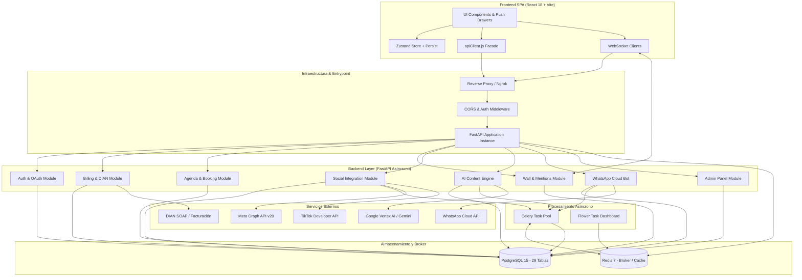
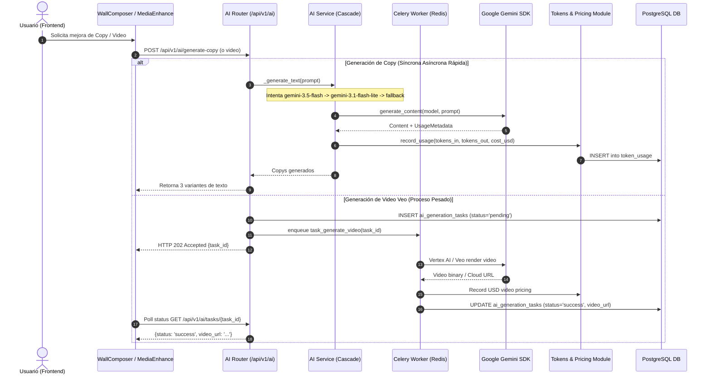
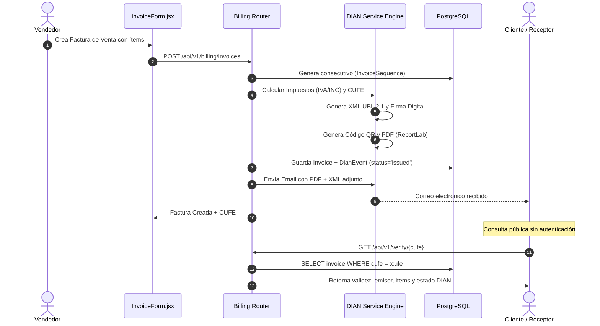

# DONAPP CONTEXT V12
## Plataforma de Gestión Empresarial con Impacto Social (Servinow / DonApp)

> **Fecha de Actualización:** Septiembre 2026  
> **Versión de Contexto:** V12 (Versión Consolidada y Actual)  
> **Estado de Madurez del Proyecto:** MVP Avanzado / Producción Ready (~9.3/10)  
> **Slogan:** *"Servir es el único negocio donde todos ganan"*  
> **Stack Principal:** React 18.3 + Vite 5.4 | FastAPI (Async) + SQLAlchemy 2.0 | PostgreSQL 15 | Celery 5.4 + Redis 7 | Docker

---

## TABLA DE CONTENIDOS

1. [Visión General y Propósito del Proyecto](#1-visión-general-y-propósito-del-proyecto)
2. [Stack Tecnológico y Métricas del Código](#2-stack-tecnológico-y-métricas-del-código)
3. [Evolución Histórica Comparativa (V1 a V12)](#3-evolución-histórica-comparativa-v1-a-v12)
4. [Arquitectura del Sistema y Diagramas de Flujo](#4-arquitectura-del-sistema-y-diagramas-de-flujo)
5. [Base de Datos: Modelo ER, Esquemas y Última Migración Alembic](#5-base-de-datos-modelo-er-esquemas-y-última-migración-alembic)
6. [Inventario y Estado de Módulos (Backend & Frontend)](#6-inventario-y-estado-de-módulos-backend--frontend)
7. [API Reference y Catálogo de Endpoints](#7-api-reference-y-catálogo-de-endpoints)
8. [Sistema de Diseño (UI/UX) y Gestión de Estado](#8-sistema-de-diseño-uiux-y-gestión-de-estado)
9. [Seguridad, Criptografía y Control de Acceso](#9-seguridad-criptografía-y-control-de-acceso)
10. [Infraestructura de Testing y Control de Calidad](#10-infraestructura-de-testing-y-control-de-calidad)
11. [Deuda Técnica, Gaps y Roadmap Priorizado](#11-deuda-técnica-gaps-y-roadmap-priorizado)

---

## 1. VISIÓN GENERAL Y PROPÓSITO DEL PROYECTO

### 1.1 ¿Qué es DonApp / Servinow?
**DonApp** es una plataforma web full-stack diseñada para la **gestión integral de micro, pequeñas y medianas empresas (PyMEs/MiPyMEs)** en Colombia y Latinoamérica, integrando un pilar nativo de **economía circular, donaciones e impacto social**.

La plataforma permite a los comerciantes:
1. Administrar inventario de productos y catálogo de servicios con soporte multimedia enriquecido (imágenes, video, audio).
2. Emitir **Facturación Electrónica DIAN** (con generación de CUFE, firma digital XML, QR, generación de PDF y envío automático por correo) y gestión de notas crédito.
3. Operar un sistema de **Agenda y Citas** para prestadores de servicios con plantillas horarias recurrentes, bloqueos de agenda y autoservicio para clientes.
4. Compartir historias de impacto en un **Muro Social en tiempo real** (vía WebSockets), permitiendo vincular productos/servicios donados y verificar menciones de clientes mediante enlaces públicos.
5. Publicar contenido cruzado en **Redes Sociales (Meta Facebook/Instagram, TikTok)** con autorización OAuth segura y cifrado de tokens en base de datos.
6. Generar copys publicitarios y videos promocionales mediante **Inteligencia Artificial Multimodal (Google Gemini + Google Veo)** con colas asíncronas y contabilidad de tokens consumidos.
7. Automatizar la atención y carga de inventario mediante un **Asistente de WhatsApp Cloud API** con comprensión de lenguaje natural (NLU).

---

## 2. STACK TECNOLÓGICO Y MÉTRICAS DEL CÓDIGO

### 2.1 Stack Tecnológico
| Capa / Componente | Tecnología | Versión | Propósito / Características |
|---|---|---|---|
| **Backend Framework** | FastAPI | 0.110.0+ | API REST asíncrona de alto rendimiento |
| **Lenguaje Backend** | Python | 3.11+ | Tipado estricto, async/await |
| **ORM & DB Driver** | SQLAlchemy 2.0 + asyncpg | 2.0.x / 0.29.x | Mapeo objeto-relacional 100% asíncrono |
| **Motor de Base de Datos** | PostgreSQL | 15-alpine | Base de datos relacional con extensiones UUID/JSONB |
| **Migraciones de BD** | Alembic | 1.13.0+ | Control de versiones de esquema (38 revisiones) |
| **Cola de Tareas** | Celery + Redis | 5.4.0+ / 7-alpine | Procesamiento asíncrono en segundo plano y broker |
| **Frontend Framework** | React + Vite | 18.3.1 / 5.4.21 | Single Page Application (SPA) modular |
| **Gestor de Estado** | Zustand | 4.5.7 | Estado global reactivo con selectores granulares y persist |
| **Enrutamiento** | React Router DOM | 6.30.4 | Rutas protegidas, layouts anidados, role guards |
| **Estilos & UI** | Vanilla CSS Artesanal | - | Design tokens (`variables.css`), Push Drawers, sin Tailwind |
| **Gráficos & Visualización** | Chart.js + react-chartjs-2 | 4.5.1 / 5.3.1 | Estadísticas de ventas, ingresos y rendimiento |
| **Seguridad & Tokens** | Cryptography (Fernet) + Jose + Bcrypt | 41.0+ / 3.3+ / 4.0+ | Cifrado simétrico de OAuth tokens, JWT HS256, hash |
| **Facturación DIAN** | ReportLab + lxml + signxml + zeep + qrcode | 4.1+ / 5.1+ / 4.0+ | Facturación electrónica, firma XML, QR, generación PDF |
| **Inteligencia Artificial** | Google GenAI SDK (Gemini + Veo) | 0.8.0+ / 2.15.0+ | Generación de copys, análisis de medios, videos Veo |
| **Contenedores** | Docker + Docker Compose | Compose v3.9 | Orquestación local (web, db, redis, worker, flower) |

### 2.2 Métricas Reales del Repositorio (Septiembre 2026)
- **Líneas de Código Backend (Python):** 19,869 líneas en `Backend/app/` distribuidas en 122 archivos.
- **Líneas de Código Frontend (JS/JSX):** 33,752 líneas en `Frontend/src/` distribuidas en 137 archivos.
- **Hojas de Estilo CSS:** 31 archivos CSS estructurados (sin frameworks utilitarios).
- **Tablas/Entidades ORM:** 29 modelos mapeados en SQLAlchemy.
- **Migraciones Alembic:** 38 revisiones versionadas secuencialmente.
- **Routers FastAPI Registrados:** 19 módulos funcionales en `Backend/app/main.py`.
- **Suites de Pruebas Backend:** 32 archivos de pruebas (`Backend/tests/`).

---

## 3. EVOLUCIÓN HISTÓRICA COMPARATIVA (V1 A V12)

```
                                      LÍNEA TEMPORAL DE EVOLUCIÓN
                                      
 V1-V2 (May 2026)      V5 (May 2026)       V7-V8 (Jun-Jul 2026)     V9-V10 (Jul-Ago 2026)      V11-V12 (Ago-Sep 2026)
 ┌──────────────┐     ┌──────────────┐     ┌──────────────────┐     ┌──────────────────┐      ┌─────────────────────────┐
 │ Setup inicial│ ──> │ Épicas / QA  │ ──> │ Facturación DIAN │ ──> │ UI Push Drawers  │ ───> │ Madurez Total (9.3/10)  │
 │ Stubs vacíos │     │ 4 Módulos BD │     │ Social OAuth     │     │ Celery+Redis+IA  │      │ 19 Módulos Activos      │
 │ Score: 3.0   │     │ Score: 6.0   │     │ Score: 7.5-8.2   │     │ Score: 8.5-8.9   │      │ 29 Tablas, 38 Migrations│
 └──────────────┘     └──────────────┘     └──────────────────┘     └──────────────────┘      └─────────────────────────┘
```

### Tabla Comparativa Histórica de Versiones

| Versión | Fecha | Enfoque Principal | Módulos Reales (Backend) | Tablas BD | Migraciones | LOC Backend | LOC Frontend | Score |
|---|---|---|---|---|---|---|---|---|
| **V1** | Mayo 2026 | Prototipo inicial, Docker, Auth básico (stubs en otros) | 1 (Auth) | 2 | 2 | ~1,200 | ~2,500 | 3.0 / 10 |
| **V2** | Mayo 2026 | Análisis arquitectónico y depuración de código legacy | 1 (Auth) | 2 | 2 | ~1,800 | ~3,800 | 3.5 / 10 |
| **V3-V4** | Mayo 2026 | Estructuración modular de carpetas y endpoints REST | 3 (Auth, Products, Categories) | 4 | 4 | ~3,200 | ~5,600 | 4.5 / 10 |
| **V5** | Mayo 2026 | Formalización de épicas de negocio y matriz de pruebas | 4 (+ Services) | 6 | 6 | ~4,800 | ~7,900 | 6.0 / 10 |
| **V6** | Mayo 2026 | Limpieza de diseño, design tokens y Wall inicial | 5 (+ Wall base) | 7 | 8 | ~5,900 | ~9,200 | 6.5 / 10 |
| **V7** | Junio 2026 | Facturación Electrónica DIAN completa (XML, QR, PDF) | 7 (+ Billing, Locations) | 12 | 13 | ~8,400 | ~11,500 | 7.5 / 10 |
| **V8** | Julio 2026 | Integración Social OAuth (Meta / TikTok) y Cifrado | 8 (+ Social) | 14 | 15 | ~9,800 | ~12,800 | 8.2 / 10 |
| **V9** | Julio 2026 | Pulido UI/UX (Push Drawers, Colapso Menú, Tablas) | 8 | 14 | 15 | ~10,500 | ~13,600 | 8.8 / 10 |
| **V10** | Agosto 2026 | Integración WhatsApp Cloud API, Gemini/Veo, Celery | 13 (+ WhatsApp, AI, Notif) | 14 | 17 | ~11,605 | ~14,076 | 8.9 / 10 |
| **V11** | Agosto 2026 | Diagnóstico e integración profunda de IA Gemini/Veo | 14 (+ Tokens/Pricing) | 16 | 21 | ~13,200 | ~18,500 | 9.0 / 10 |
| **V12** | **Septiembre 2026** | **Sistema Integral Completo:** Agenda real, Admin Users/Social/Tokens, Búsqueda Global, 32 suites tests, Verificación pública CUFE/Muro, Cascada IA | **19 módulos activos** | **29 tablas** | **38 migraciones** | **19,869** | **33,752** | **9.3 / 10** |

---

## 4. ARQUITECTURA DEL SISTEMA Y DIAGRAMAS DE FLUJO

### 4.1 Diagrama de Arquitectura Global



### 4.2 Flujo de Inteligencia Artificial (Cascada Gemini + Celery Veo + Control de Tokens)



### 4.3 Flujo de Facturación Electrónica DIAN y Verificación Pública



---

## 5. BASE DE DATOS: MODELO ER, ESQUEMAS Y ÚLTIMA MIGRACIÓN ALEMBIC

### 5.1 Últimas Migraciones Alembic (Cadena Reciente)
El sistema cuenta con **38 migraciones versionadas en Alembic**. Las revisiones más recientes incluyen:

1. **`821b8d4af17a_fix_cascade_delete_on_user_foreign_keys.py` (ÚLTIMA MIGRACIÓN - Sep 13, 2026):**
   - Corrige restricciones de clave foránea en `social_posts.user_id` habilitando `ondelete='CASCADE'` para permitir la eliminación segura de usuarios desde el panel de administración sin errores de integridad referencial.
2. **`99b1649d36ec_add_approval_and_activation_code_to_users.py` (Sep 6, 2026):**
   - Agrega las columnas `is_approved` (Boolean, default True) y `activation_code` (String 50, nullable) a la tabla `users` para el flujo de validación y control administrativo de usuarios.
3. **`b3c8f1a29e7d_add_task_type_to_ai_generation_tasks.py` (Ago 29, 2026):**
   - Agrega `task_type` (`generate_video`, `enhance_audio`, `enhance_video`) a `ai_generation_tasks`.
4. **`6b8b3f369d2d_add_uploaded_files_table.py` (Ago 29, 2026):**
   - Crea la tabla `uploaded_files` para auditoría y metadata de archivos locales y en la nube.
5. **`7936d3d9925e_add_media_urls_to_inventory.py` y `7e6a9807985b_add_media_urls_to_social_posts.py` (Ago 23, 2026):**
   - Soporte para galerías JSONB de múltiples medios en `products`, `services` y `social_posts`.

### 5.2 Diagrama Entidad-Relación (Mermaid ER Diagram)

```mermaid
erDiagram
    USERS ||--o{ PRODUCTS : "crea (1:N)"
    USERS ||--o{ SERVICES : "crea (1:N)"
    USERS ||--o{ CATEGORIES : "administra (1:N)"
    USERS ||--o{ SOCIAL_ACCOUNTS : "vincula (1:N)"
    USERS ||--o{ SOCIAL_POSTS : "publica (1:N)"
    USERS ||--o{ POSTS : "autor de (1:N)"
    USERS ||--o{ COMMENTS : "comenta (1:N)"
    USERS ||--o{ CUSTOMERS : "registra clientes (1:N)"
    USERS ||--o{ INVOICES : "emite (1:N)"
    USERS ||--o{ CREDIT_NOTES : "emite (1:N)"
    USERS ||--o{ AVAILABILITY_TEMPLATES : "configura (1:N)"
    USERS ||--o{ AVAILABILITY_OVERRIDES : "configura (1:N)"
    USERS ||--o{ APPOINTMENTS : "atiende como seller (1:N)"
    USERS ||--o{ APPOINTMENTS : "solicita como client (1:N)"
    USERS ||--o{ NOTIFICATIONS : "recibe (1:N)"
    USERS ||--o{ TOKEN_USAGE : "consume (1:N)"
    USERS ||--o{ AI_GENERATION_TASKS : "solicita (1:N)"

    CATEGORIES ||--o{ CATEGORIES : "padre-hijo (1:N)"
    CATEGORIES ||--o{ PRODUCTS : "clasifica (1:N)"
    CATEGORIES ||--o{ SERVICES : "clasifica (1:N)"

    POSTS ||--o{ POST_MEDIA : "contiene (1:N)"
    POSTS ||--o{ COMMENTS : "recibe (1:N)"
    POSTS ||--o{ WALL_POST_CUSTOMER_MENTIONS : "menciona (1:N)"
    POSTS ||--o| PRODUCTS : "asocia producto (0..1)"
    POSTS ||--o| SERVICES : "asocia servicio (0..1)"

    CUSTOMERS ||--o{ INVOICES : "facturado a (1:N)"
    CUSTOMERS ||--o{ CREDIT_NOTES : "nota a (1:N)"
    CUSTOMERS ||--o{ WALL_POST_CUSTOMER_MENTIONS : "beneficiario en (1:N)"

    INVOICES ||--o{ INVOICE_ITEMS : "detalla (1:N)"
    INVOICES ||--o{ CREDIT_NOTES : "anulada/ajustada por (1:N)"
    INVOICES ||--o{ DIAN_EVENTS : "historial DIAN (1:N)"
    CREDIT_NOTES ||--o{ CREDIT_NOTE_ITEMS : "detalla (1:N)"

    SERVICES ||--o{ APPOINTMENTS : "agendado en (1:N)"

    USERS {
        uuid id PK
        string email UK
        string hashed_password
        string full_name
        string role "admin | seller | client"
        boolean is_active
        boolean is_staff
        boolean is_approved
        string activation_code
        string google_id
        string whatsapp_phone
        string business_name
        string avatar_url
        datetime created_at
    }

    PRODUCTS {
        uuid id PK
        uuid user_id FK
        uuid category_id FK
        string name
        text description
        numeric price
        integer stock
        string status "active | inactive | out_of_stock"
        string image_url
        string video_url
        jsonb media_urls
        datetime created_at
    }

    SERVICES {
        uuid id PK
        uuid user_id FK
        uuid category_id FK
        string name
        text description
        numeric price
        integer duration_minutes
        string status
        jsonb media_urls
        datetime created_at
    }

    CATEGORIES {
        uuid id PK
        uuid parent_id FK
        string name
        string slug UK
        string entity_type "product | service"
        string status
    }

    INVOICES {
        uuid id PK
        uuid user_id FK
        uuid customer_id FK
        string invoice_number UK
        string cufe UK
        string status "issued | cancelled | error"
        numeric subtotal
        numeric tax_amount
        numeric total
        string pdf_url
        string xml_url
        string payment_method
        datetime issue_date
    }

    INVOICE_ITEMS {
        uuid id PK
        uuid invoice_id FK
        uuid product_id FK
        uuid service_id FK
        string description
        numeric quantity
        numeric unit_price
        numeric total_price
    }

    POSTS {
        uuid id PK
        uuid author_id FK
        uuid product_id FK
        uuid service_id FK
        text content
        string type "Donación | Testimonio"
        boolean is_edited
        datetime created_at
    }

    POST_MEDIA {
        uuid id PK
        uuid post_id FK
        string media_url
        string media_type "image | video | audio"
        integer order_index
    }

    APPOINTMENTS {
        uuid id PK
        uuid seller_id FK
        uuid client_id FK
        uuid service_id FK
        date appointment_date
        time start_time
        time end_time
        string status "pending | confirmed | cancelled | completed"
        string cancellation_reason
    }

    SOCIAL_ACCOUNTS {
        uuid id PK
        uuid user_id FK
        string platform "facebook | instagram | tiktok"
        string platform_user_id
        string encrypted_access_token
        string status "active | expired | error"
        boolean is_default
    }

    AI_GENERATION_TASKS {
        uuid id PK
        uuid user_id FK
        string task_type "generate_video | enhance_audio"
        string status "pending | success | failed"
        string video_url
        numeric estimated_cost_usd
        datetime created_at
    }

    TOKEN_USAGE {
        uuid id PK
        uuid user_id FK
        integer input_tokens
        integer output_tokens
        numeric cost_usd
        string model_name
        datetime created_at
    }
```



---

## 6. INVENTARIO Y ESTADO DE MÓDULOS (BACKEND & FRONTEND)

```
                                  MATRIZ DE ESTADO DE MÓDULOS
┌───────────────────────┬──────────┬──────────┬─────────────────────────────────────────────────────────┐
│ Módulo Funcional      │ Frontend │ Backend  │ Cobertura y Capacidades Implementadas                  │
├───────────────────────┼──────────┼──────────┼─────────────────────────────────────────────────────────┤
│ 1. Autenticación      │    ✅    │    ✅    │ JWT HS256, Google OAuth con PKCE, recuperación clave.   │
│ 2. Inventario Prods.  │    ✅    │    ✅    │ CRUD, carga Excel (.xlsx), galerías multimedia, tenant. │
│ 3. Catálogo Servicios │    ✅    │    ✅    │ CRUD, duración en min, tarifas, vinculación categorías. │
│ 4. Categorías         │    ✅    │    ✅    │ Árbol jerárquico, slugs automáticos, filtro por entidad.│
│ 5. Clientes           │    ✅    │    ✅    │ Directorio de receptores de factura con NIT/cédula.     │
│ 6. Facturación DIAN   │    ✅    │    ✅    │ CUFE, firma XML, PDF ReportLab, email Jinja2, notas cr. │
│ 7. Verificación CUFE  │    ✅    │    ✅    │ Portal público (/verify/:cufe) de validación de factura.│
│ 8. Agenda & Citas     │    ✅    │    ✅    │ Templates semanales, Overrides de fechas, Booking client│
│ 9. Muro Social        │    ✅    │    ✅    │ WebSockets en vivo, menciones de clientes, verificación.│
│ 10. Redes Sociales    │    ✅    │    ✅    │ OAuth Meta & TikTok, cifrado Fernet, posteo en Celery.  │
│ 11. Motor IA Generat. │    ✅    │    ✅    │ Cascada Gemini, Veo Video Generator, control de tokens. │
│ 12. WhatsApp Bot      │    ✅    │    ✅    │ Webhook HMAC-SHA256, NLU Gemini intents, OTP linking.   │
│ 13. Notificaciones    │    ✅    │    ✅    │ WebSockets push en tiempo real + almacenamiento en BD.  │
│ 14. Búsqueda Global   │    ✅    │    ✅    │ Endpoint unificado (/api/v1/search) multi-entidad.      │
│ 15. Admin Usuarios    │    ✅    │    ✅    │ Gestión staff, aprobaciones, reseteo contraseñas, roles.│
│ 16. Admin Social      │    ✅    │    ✅    │ Monitor y auditoría de cuentas sociales conectadas.     │
│ 17. Admin Tokens      │    ✅    │    ✅    │ Tasas de cambio USD-COP, control y auditoría de costos. │
│ 18. Estadísticas      │    ✅    │    ✅    │ Métricas de facturación, productos más vendidos, grafs. │
│ 19. Estudio Mercado   │    ⚠️    │    ❌    │ Frontend maquetado con MockData (requiere scraping/API).│
└───────────────────────┴──────────┴──────────┴─────────────────────────────────────────────────────────┘
```

---

## 7. API REFERENCE Y CATÁLOGO DE ENDPOINTS

El backend registra 19 routers en `Backend/app/main.py` con prefijo `/api/v1`:

### 7.1 Autenticación & Usuarios (`/api/v1/auth`)
- `POST /register`: Registro de usuario con hashing de contraseña.
- `POST /login`: Autenticación con credenciales y entrega de Access Token JWT.
- `GET /me`: Obtener información del usuario autenticado.
- `PUT /profile`: Actualización de perfil y avatar.
- `POST /google`: Inicio de sesión / vinculación con Google OAuth (PKCE).
- `POST /forgot-password` & `POST /reset-password`: Flujo de recuperación de clave vía token firmado.

### 7.2 Productos & Servicios (`/api/v1/products`, `/api/v1/services`, `/api/v1/categories`)
- `GET/POST /products`: Listado paginado y creación con aislamiento multi-tenant.
- `GET/PUT/DELETE /products/{id}`: Detalle, edición y borrado de producto.
- `POST /products/bulk-import`: Carga masiva de inventario vía hoja de cálculo Excel.
- `GET/POST /services` & `GET/PUT/DELETE /services/{id}`: Gestión completa de servicios.
- `GET/POST /categories`: Gestión de categorías de productos y servicios.

### 7.3 Facturación Electrónica (`/api/v1/billing`)
- `GET/POST /invoices`: Listado con filtros y emisión de facturas.
- `GET /invoices/{id}`: Detalle con ítems, estado DIAN y URLs de PDF/XML.
- `POST /invoices/{id}/credit-note`: Emisión de nota crédito por anulación/ajuste.
- `GET /statistics/summary`, `/statistics/top-selling`, `/statistics/revenue-by-line`: Métricas analíticas.
- `GET /customers` & `POST /customers`: Directorio de clientes facturables.
- `GET /api/v1/verify/{cufe}`: Endpoint público para validación de facturas por CUFE.

### 7.4 Agenda y Citas (`/api/v1/agenda`)
- `GET/POST /templates`: Plantillas de horario recurrente del vendedor.
- `GET/POST/DELETE /overrides`: Excepciones y bloqueos de fechas específicas.
- `GET /slots`: Consulta de turnos disponibles para un vendedor y fecha determinada.
- `GET/POST/PUT /appointments`: Creación y cambio de estado de citas (`confirmed`, `cancelled`).

### 7.5 Muro Social & Menciones (`/api/v1/wall`)
- `GET/POST /posts`: Consulta de muro y publicación de donaciones/testimonios.
- `POST /posts/{id}/comments`: Interacción mediante comentarios.
- `WS /ws/wall`: Canal WebSocket para recepción de nuevos posts y reacciones en vivo.
- `GET/POST /api/v1/public/mentions/{token}/confirm`: Verificación pública de mención comunitaria.

### 7.6 Redes Sociales & Publicación (`/api/v1/social`)
- `GET /accounts`: Listado de cuentas sociales conectadas (Meta, TikTok).
- `POST /connect/{platform}`: Inicio de flujo de vinculación OAuth.
- `POST /publish`: Publicación cruzada en redes sociales mediante tareas Celery.

### 7.7 Inteligencia Artificial & Tokens (`/api/v1/ai`, `/api/v1/tokens`)
- `POST /generate-copy`: Generación de textos comerciales con cascada Gemini.
- `POST /describe-media`: Análisis multimodal de imágenes/video para copy sugerido.
- `POST /generate-video`: Encolado de renderizado de video en Celery (Google Veo).
- `GET /tasks/{task_id}`: Polling de estado de generación de video.
- `GET /api/v1/tokens/usage`: Registro de consumo y cotización en USD/COP.

### 7.8 Asistente WhatsApp Cloud API (`/api/v1/whatsapp`)
- `GET /webhook`: Verificación del Challenge de Meta.
- `POST /webhook`: Procesamiento de mensajes entrantes con firma HMAC-SHA256 y NLU.
- `POST /link-otp`: Generación y validación de OTP para asociar número al negocio.

### 7.9 Panel de Administración (`/api/v1/admin`)
- `GET/PUT/DELETE /admin/users`: Gestión integral de cuentas de usuario y permisos de staff.
- `GET/DELETE /admin/social/accounts`: Auditoría de cuentas sociales vinculadas.
- `GET/POST /admin/tokens/exchange-rates`: Configuración de tasa de cambio USD-COP.

### 7.10 Búsqueda Global (`/api/v1/search`)
- `GET /search?q={term}`: Búsqueda unificada en productos, servicios, facturas y clientes.

---

## 8. SISTEMA DE DISEÑO (UI/UX) Y GESTIÓN DE ESTADO

### 8.1 Patrones de Interfaz
- **Push Drawer Lateral:** Los paneles laterales derechos (`ItemDetailDrawer`, `InvoiceForm`, `WallComposer`) desplazan físicamente el contenedor principal `.app-main` mediante transiciones CSS aceleradas por GPU, evitando overlays oscuros intrusivos en pantallas de escritorio.
- **Smart Sidebar Colapsable:** La barra de navegación lateral detecta la apertura de drawers y se contrae automáticamente a modo de solo iconos, optimizando el área de trabajo útil.
- **Tablas con `<colgroup>` y Ancho Fijo:** Implementado en `Table.jsx` para evitar que el navegador redimensione dinámicamente las columnas al cargar datos asíncronos.
- **Design Tokens Nativos:** Paleta semántica en `variables.css` con variables CSS adaptativas para temas Claro y Oscuro persistentes (`data-theme="dark"`).

### 8.2 Gestión de Estado con Zustand (`useStore.js`)
```javascript
// Antipatrón Evitado: const { theme, currentUser } = useStore(); (causa re-renders masivos)
// Patrón Correcto Establecido: Selectores Granulares
const currentUser = useStore(state => state.currentUser);
const activeViewMode = useStore(state => state.activeViewMode);
const sidebarCollapsed = useStore(state => state.sidebarCollapsed);
```
- **Persistencia Segura:** Middleware `persist` con wrapper `safeStorage` que previene errores de ejecución en entornos donde `localStorage` esté restringido (modo incógnito o políticas de privacidad).

---

## 9. SEGURIDAD, CRIPTOGRAFÍA Y CONTROL DE ACCESO

1. **Cifrado Simétrico Fernet (`security_tokens.py`):** Los Access Tokens y Refresh Tokens de Meta y TikTok se almacenan cifrados en base de datos bajo tipo personalizado `EncryptedString`.
2. **Autenticación Híbrida:** JWT estándar (HS256) para sesiones de usuario y Google OAuth con flujo PKCE y validación de certificados JWKS.
3. **Validación Criptográfica de Webhooks:** Verificación de firma `X-Hub-Signature-256` con clave secreta HMAC para todos los eventos entrantes de WhatsApp y TikTok.
4. **Protección Contra Fuerza Bruta:** Bloqueo temporal y rate limiting en Redis para intentos fallidos de OTP en WhatsApp y login de administración.
5. **Control de Acceso Basado en Roles (RBAC):** Roles `admin`, `seller`, `client` y bandera de seguridad `is_staff` validados a nivel de endpoints backend (`Depends(get_current_staff_user)`) y rutas frontend (`ProtectedRoute`).

---

## 10. INFRAESTRUCTURA DE TESTING Y CONTROL DE CALIDAD

El backend dispone de **32 suites de pruebas automatizadas con pytest y pytest-asyncio**:
- **Aislamiento Multi-Tenant:** `test_tenant_isolation.py`, `test_ownership.py`.
- **Integración WhatsApp:** 10 suites especializadas (`test_webhook_signature.py`, `test_otp_lockout.py`, `test_intent_draft_merge.py`, etc.).
- **Facturación y Estadísticas:** `test_billing_statistics.py`.
- **Social OAuth y Cifrado:** `test_social_oauth.py`, `test_social_persistence.py`, `test_social_tiktok_publish.py`.
- **Muro Social y Menciones:** `test_wall_mentions.py`, `test_wall_empirical_serialize.py`.
- **Administración y Usuarios:** `test_admin_users.py`, `test_activation_forward.py`.

---

## 11. DEUDA TÉCNICA, GAPS Y ROADMAP PRIORIZADO

### Prioridad Inmediata (P0)
1. **Migración a Cloud Storage para Uploads:** Migrar el almacenamiento local de `uploads/` a Amazon S3, Google Cloud Storage o Cloudinary para soportar despliegues elásticos multi-instancia.
2. **Rotación de Credenciales de Prueba:** Formalizar la rotación de claves Meta/TikTok documentadas en `CREDENCIALES_ROTAR.md`.

### Prioridad Alta (P1)
3. **Par Refresh Token + Access Token:** Reemplazar el JWT único de larga duración por un esquema de `access_token` corto (15 min) + `refresh_token` rotativo (30 días) en cookies HttpOnly y lista de revocación en Redis.
4. **Suite de Pruebas Automatizadas en Frontend:** Configurar Vitest + React Testing Library para componentes críticos (`InvoiceForm`, `WallComposer`, `useStore`).

### Prioridad Media (P2)
5. **Evolución del Modelo Multi-Tenant a Empresas/Organizaciones:** Crear la entidad `Organization` y tabla intermedia `OrganizationMember` para permitir que múltiples empleados compartan el inventario y facturación de un mismo negocio.
6. **Backend Real para Estudio de Mercado (`Market`):** Reemplazar `MockData.js` en el módulo de mercado por un motor de geolocalización y agregación de precios regional.

---
*Fin del documento DONAPP_CONTEXT V12.md — Documento de referencia técnica del proyecto.*
